# Weather Conditions Card

`ha-card-weather-conditions` is a Lovelace card for Home Assistant that combines current conditions, forecasts, marine data, air quality, pollen, UV index and weather alerts into a single configurable card.

[](https://github.com/hacs/integration)
[![License][license-shield]](LICENSE)
[![BuyMeCoffee][buymecoffeebadge]][buymecoffee]

---

## Features

- Current and forecast weather conditions
- Marine forecast (swell, wave, wind, water temperature)
- Ultraviolet radiation index and protection advice
- Pollen level display (tree, weed, grass)
- Air quality index with multiple pollutant types
- Weather alerts (fire, storm, hydrogeological, hydraulic)
- Lightning strike monitoring (azimuth, distance, strike count)
- Meteogram and camera integration
- Wind direction map (OpenStreetMap tiles)
- Multilingual support, with optional language/timezone/number-format overrides
- Configurable module order and visibility
- MeteoAlarm (Early Warnings for Europe) and Dipartimento Protezione Civile (Italy) alerts

<p float="left">
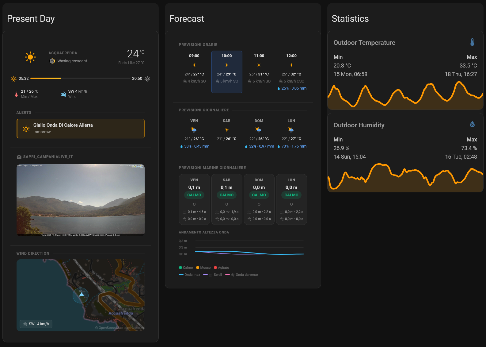
</p>

---

## Installation

Add the card resource to your Lovelace dashboard configuration:

```yaml
resources:
  # Required: load the card (installed via HACS)
  - url: /hacsfiles/ha-card-weather-conditions/ha-card-weather-conditions.js
    type: module
  # Optional: enable advanced styling via Card Mod
  - url: /hacsfiles/lovelace-card-mod/card-mod.js
    type: module
```

---

## Card Schema

### Top-level parameters

| Parameter      | Type       | Required | Default | Description |
| -------------- | ---------- | -------- | ------- | ----------- |
| `type`         | `string`   | **Yes**  | —       | Must be `custom:ha-card-weather-conditions`. |
| `name`         | `string`   | No       | —       | Display name shown in the card header. |
| `language`     | `string`   | No       | `en`    | UI language. Supported values: `en`, `it`, `nl`, `es`, `de`, `fr`, `sr-latn`, `pt`, `da`, `no-NO`, `cs`, `ru`. |
| `timezone`     | `string`   | No       | —       | Time zone override (IANA name, e.g. `Europe/Rome`) used to format dates and times. If omitted, the time zone configured in Home Assistant is used. |
| `number_format`| `string`   | No       | `language` | Number formatting style. See [Number Format](#number-format). |
| `module_order` | `string[]` | No       | —       | Order and visibility of the card's modules. See [Module Order](#module-order). |
| `weather`      | `object`   | **Yes**  | —       | Main weather data source. See [§1 `weather`](#1-weather-object). |
| `ultraviolet`  | `object`   | No       | —       | UV index and skin exposure data. See [§2 `ultraviolet`](#2-ultraviolet-object). |
| `pollen`       | `object`   | No       | —       | Airborne pollen levels. See [§3 `pollen`](#3-pollen-object). |
| `airquality`   | `object`   | No       | —       | Air quality index and pollutants. See [§4 `airquality`](#4-airquality-object). |
| `camera`       | `string`   | No       | —       | Entity ID of a camera to embed in the card. |
| `wind_map`     | `object`   | No       | —       | Wind direction map. See [§5 `wind_map`](#5-wind_map-object). |

#### Number Format

`number_format` controls how decimal and thousands separators are rendered, independently of the selected `language`.

| Value           | Description |
| --------------- | ----------- |
| `language`       | Use the separators conventionally associated with `language` (default). |
| `comma_decimal`  | Decimal point as comma, thousands separator as dot (e.g. `1.234,5`). |
| `decimal_comma`  | Decimal point as dot, thousands separator as comma (e.g. `1,234.5`). |
| `space_comma`    | Decimal point as comma, thousands separator as space (e.g. `1 234,5`). |
| `none`           | No thousands separator, decimal point as dot (e.g. `1234.5`). |

#### Module Order

By default, the card shows each module based solely on whether its configuration is present, in a fixed order. Setting `module_order` overrides this: only the listed modules are shown, in the order given.

Valid values: `summary`, `present`, `daily_forecasts`, `hourly_forecasts`, `marine_daily`, `marine_hourly`, `meteoalarm`, `pollen`, `ultraviolet`, `airquality`, `camera`, `wind_map`.

```yaml
module_order:
  - summary
  - present
  - daily_forecasts
  - hourly_forecasts
```

---

## 1 `weather` Object

Configures the main weather block: current conditions, forecasts, marine data, and alerts. Tested with `pirateweather`, `climacell`, `darksky`, and `openweathermap` integrations.

| Parameter                 | Type      | Required | Default         | Description |
| -------------------------- | --------- | -------- | --------------- | ----------- |
| `name`                     | `string`  | No       | —               | Location name displayed in the summary section. |
| `sun`                      | `string`  | No       | —               | Entity ID for the sun sensor (adjusts visuals for daylight, sunrise, and sunset). |
| `sun_time_format`          | `string`  | No       | `hh_mm`         | Time format for sunrise/sunset in the sun bar. Allowed values: `hh_mm`, `hh_mm_ss`. |
| `moonphase`                | `string`  | No       | —               | Entity ID for the moon phase sensor. |
| `icons_model`              | `string`  | **Yes**  | `pirateweather` | Icon set to use. Supported values: `pirateweather`, `climacell`, `darksky`, `openweathermap`, `buienradar`, `defaulthass`. |
| `animation`                | `boolean` | No       | `false`         | Enables animated effects (moving clouds, rain, waves) based on conditions. |
| `present`                  | `object`  | No       | —               | Current weather conditions. See [§1.1 `present`](#11-present-object). |
| `daily_forecasts`          | `object`  | No       | —               | Multi-day forecast data. See [§1.2 `daily_forecasts`](#12-daily_forecasts-object). |
| `hourly_forecasts`         | `object`  | No       | —               | Hourly forecast data. See [§1.3 `hourly_forecasts`](#13-hourly_forecasts-object). |
| `marine_daily_forecasts`   | `object`  | No       | —               | Daily marine forecast (wave height, swell, wind). See [§1.4 `marine_daily_forecasts`](#14-marine_daily_forecasts-object). |
| `marine_hourly_forecasts`  | `object`  | No       | —               | Hourly marine forecast (swell, wind, water temperature). See [§1.5 `marine_hourly_forecasts`](#15-marine_hourly_forecasts-object). |
| `meteoalarm`               | `string`  | No       | —               | Entity ID from the [Meteoalarm](https://meteoalarm.org/) integration for regional warnings. |
| `dpcalarm`                 | `object`  | No       | —               | Italian Civil Protection (DPC) alert sensors. See [§1.6 `dpcalarm`](#16-dpcalarm-object). |

### 1.1 `present` Object

Real-time environmental data shown in the current conditions section.

| Parameter                    | Type     | Required | Description |
| ------------------------------ | -------- | -------- | ----------- |
| `condition`                    | `string` | No       | Current weather condition (e.g. `sunny`, `cloudy`, `rain`). |
| `temperature`                  | `string` | No       | Current temperature. |
| `temperature_feelslike`        | `string` | No       | Perceived (feels-like) temperature. |
| `temperature_min`              | `string` | No       | Daily minimum temperature. |
| `temperature_max`              | `string` | No       | Daily maximum temperature. |
| `humidity`                     | `string` | No       | Relative humidity (%). |
| `pressure`                     | `string` | No       | Atmospheric pressure. |
| `visibility`                   | `string` | No       | Visibility distance. |
| `wind_bearing`                 | `string` | No       | Wind direction in degrees. |
| `wind_speed`                   | `string` | No       | Wind speed. |
| `precipitation_intensity`      | `string` | No       | Precipitation rate (e.g. mm/h). |
| `precipitation_probability`    | `string` | No       | Probability of precipitation (%). |
| `precipitation_accumulation`   | `string` | No       | Total precipitation accumulation. |
| `lightning_azimuth`            | `string` | No       | Bearing to the nearest detected lightning strike. |
| `lightning_distance`           | `string` | No       | Distance to the nearest detected lightning strike. |
| `lightning_strikes`            | `string` | No       | Number of lightning strikes in the last 30 seconds. |

### 1.2 `daily_forecasts` Object

Multi-day weather forecast. Each field uses an [`iTimeSlots`](#itimeslots-object) object to hold up to six daily values.

Every entity referenced here must expose two attributes:

- `datetime` — forecast reference time in ISO 8601 format (e.g. `2025-06-12T22:00:00+00:00`)
- `unit_of_measurement` — unit of the forecasted value (e.g. `°C`, `mm`, `%`)

| Parameter                   | Type         | Required | Description |
| --------------------------- | ------------ | -------- | ----------- |
| `condition`                 | `iTimeSlots` | No       | Weather condition icon/state for each day slot. |
| `temperature_high`          | `iTimeSlots` | No       | Daily high temperature per slot. |
| `temperature_low`           | `iTimeSlots` | No       | Daily low temperature per slot. |
| `precipitation_intensity`   | `iTimeSlots` | No       | Forecasted precipitation amount per slot. |
| `precipitation_probability` | `iTimeSlots` | No       | Probability of precipitation (%) per slot. |
| `meteogram`                 | `string`     | No       | Entity ID or URL of a meteogram image to embed. |

### 1.3 `hourly_forecasts` Object

Hour-by-hour forecast data. Each field uses an [`iTimeSlots`](#itimeslots-object) object to hold up to six hourly values.

Same `datetime` and `unit_of_measurement` attribute requirements apply as in `daily_forecasts`.

| Parameter                   | Type         | Required | Description |
| --------------------------- | ------------ | -------- | ----------- |
| `condition`                 | `iTimeSlots` | No       | Weather condition per hourly slot. |
| `temperature`               | `iTimeSlots` | No       | Ambient temperature per hour. |
| `temperature_feelslike`     | `iTimeSlots` | No       | Feels-like temperature per hour. |
| `precipitation_intensity`   | `iTimeSlots` | No       | Precipitation amount per hour. |
| `precipitation_probability` | `iTimeSlots` | No       | Probability of precipitation (%) per hour. |
| `wind_bearing`              | `iTimeSlots` | No       | Wind direction per hour. |
| `wind_speed`                | `iTimeSlots` | No       | Wind speed per hour. |

### `iTimeSlots` Object

Represents up to six sequential time slots used by forecast objects.

| Parameter | Type     | Required | Description |
| --------- | -------- | -------- | ----------- |
| `slot1`   | `string` | No       | First time slot (entity ID). |
| `slot2`   | `string` | No       | Second time slot (entity ID). |
| `slot3`   | `string` | No       | Third time slot (entity ID). |
| `slot4`   | `string` | No       | Fourth time slot (entity ID). |
| `slot5`   | `string` | No       | Fifth time slot (entity ID). |
| `slot6`   | `string` | No       | Sixth time slot (entity ID). |

### 1.4 `marine_daily_forecasts` Object

Daily marine weather data. Each field uses an [`iTimeSlots`](#itimeslots-object) object.

| Parameter                | Type         | Required | Description |
| ------------------------- | ------------ | -------- | ----------- |
| `wave_height_max`         | `iTimeSlots` | No       | Maximum overall wave height per day. |
| `wave_direction`          | `iTimeSlots` | No       | Dominant wave direction per day. |
| `swell_wave_height_max`   | `iTimeSlots` | No       | Maximum swell wave height per day. |
| `wind_wave_height_max`    | `iTimeSlots` | No       | Maximum wind-generated wave height per day. |
| `swell_wave_period_max`   | `iTimeSlots` | No       | Maximum swell wave period (seconds) per day. |
| `wind_wave_period_max`    | `iTimeSlots` | No       | Maximum wind-generated wave period (seconds) per day. |

### 1.5 `marine_hourly_forecasts` Object

Hourly marine weather data. Each field uses an [`iTimeSlots`](#itimeslots-object) object.

| Parameter           | Type         | Required | Description |
| ------------------- | ------------ | -------- | ----------- |
| `swell_direction`   | `iTimeSlots` | No       | Swell direction per hour. |
| `swell_height`      | `iTimeSlots` | No       | Swell height per hour. |
| `swell_period`      | `iTimeSlots` | No       | Swell period (seconds) per hour. |
| `wind_direction`    | `iTimeSlots` | **Yes**  | Wind direction per hour. |
| `wind_speed`        | `iTimeSlots` | **Yes**  | Wind speed per hour. |
| `air_temperature`   | `iTimeSlots` | **Yes**  | Air temperature per hour. |
| `water_temperature` | `iTimeSlots` | **Yes**  | Sea surface water temperature per hour. |

### 1.6 `dpcalarm` Object

Weather alerts from the Italian Civil Protection Department (Dipartimento della Protezione Civile). Each field should reference a binary sensor entity.

| Parameter         | Type     | Required | Description |
| ----------------- | -------- | -------- | ----------- |
| `thunderstorms`   | `string` | No       | Thunderstorm alert sensor. |
| `hydraulic`       | `string` | No       | Hydraulic (river/stream flooding) alert sensor. |
| `hydrogeological` | `string` | No       | Hydrogeological (landslide/soil instability) alert sensor. |

---

## 2 `ultraviolet` Object

UV radiation data including current index, ozone level, protection window, and safe exposure times for each skin type (I–VI).

| Parameter           | Type     | Required | Description |
| -------------------- | -------- | -------- | ----------- |
| `uv_index`           | `string` | No       | Current UV index value. |
| `uv_level`           | `string` | No       | UV risk level description (e.g. `low`, `moderate`, `high`). |
| `max_uv_index`       | `string` | No       | Maximum forecasted UV index for the day. |
| `ozone_level`        | `string` | No       | Current atmospheric ozone concentration. |
| `protection_window`  | `string` | No       | Time window during which sun protection is recommended. |
| `set_skin_type_1`    | `string` | No       | Safe exposure time for skin type I. |
| `set_skin_type_2`    | `string` | No       | Safe exposure time for skin type II. |
| `set_skin_type_3`    | `string` | No       | Safe exposure time for skin type III. |
| `set_skin_type_4`    | `string` | No       | Safe exposure time for skin type IV. |
| `set_skin_type_5`    | `string` | No       | Safe exposure time for skin type V. |
| `set_skin_type_6`    | `string` | No       | Safe exposure time for skin type VI. |

---

## 3 `pollen` Object

Airborne allergen levels. Defines the display range and a list of pollen types to track.

| Parameter  | Type            | Required | Description |
| ---------- | --------------- | -------- | ----------- |
| `min`      | `number`        | **Yes**  | Minimum pollen concentration value (used for scaling the display). |
| `max`      | `number`        | **Yes**  | Maximum pollen concentration value (used for scaling the display). |
| `entities` | `iPollenItem[]` | **Yes**  | List of pollen types to display. See [§3.1 `iPollenItem`](#31-ipollenitem-object). |

### 3.1 `iPollenItem` Object

Defines a single pollen type entry.

| Parameter | Type     | Required | Description |
| --------- | -------- | -------- | ----------- |
| `name`    | `string` | **Yes**  | Display name (e.g. `Grass`, `Birch`). |
| `entity`  | `string` | **Yes**  | Entity ID providing the pollen concentration data. |

---

## 4 `airquality` Object

Real-time air quality metrics and EPA health indicators.

| Parameter               | Type     | Required | Description |
| ------------------------ | -------- | -------- | ----------- |
| `pm25`                   | `string` | No       | PM2.5 (fine particulate matter) concentration. |
| `pm10`                   | `string` | No       | PM10 (coarse particulate matter) concentration. |
| `o3`                     | `string` | No       | Ozone (O₃) concentration. |
| `no2`                    | `string` | No       | Nitrogen Dioxide (NO₂) concentration. |
| `co`                     | `string` | No       | Carbon Monoxide (CO) concentration. |
| `so2`                    | `string` | No       | Sulfur Dioxide (SO₂) concentration. |
| `epa_aqi`                | `string` | No       | EPA-computed Air Quality Index. |
| `epa_primary_pollutant`  | `string` | No       | EPA-designated primary pollutant. |
| `epa_health_concern`     | `string` | No       | EPA health concern level (e.g. `moderate`, `unhealthy`). |

---

## 5 `wind_map` Object

Renders a small map showing the current wind direction using OpenStreetMap tiles. Disabled by default, since enabling it sends the configured coordinates to the tile provider.

| Parameter         | Type      | Required | Default      | Description |
| ----------------- | --------- | -------- | ------------ | ----------- |
| `enabled`         | `boolean` | No       | `false`      | Explicit opt-in. The map is not shown unless this is set to `true`. |
| `latitude`        | `number`  | No       | Home Assistant home latitude | Map center latitude. Falls back to `hass.config.latitude` if omitted. |
| `longitude`       | `number`  | No       | Home Assistant home longitude | Map center longitude. Falls back to `hass.config.longitude` if omitted. |
| `zoom`            | `number`  | No       | `12`         | Map zoom level. |
| `tile_style`      | `string`  | No       | `standard`   | Tile style. One of `standard`, `cyclosm`, `humanitarian`, `cycle`, `transport`, `topo`. `cycle`, `transport` and `topo` require `tile_api_key`. |
| `tile_api_key`    | `string`  | No       | —            | Personal API key for the tile provider, required only for `cycle`, `transport`, or `topo`. |
| `tile_url`        | `string`  | No       | —            | Full tile URL template, e.g. `https://{s}.example.com/{z}/{x}/{y}.png`. Takes priority over `tile_style` when set. |
| `tile_attribution`| `string`  | No       | —            | Attribution text to display when using a custom `tile_url`. |
| `brightness`      | `number`  | No       | `0.65` (dark theme) / `1` (light theme or `tile_dark` enabled) | `brightness()` component of the CSS filter applied to the tiles, in the range 0–2. |
| `tile_dark`       | `boolean` | No       | `false`      | Applies `invert(90%) hue-rotate(180deg)`, combined with `brightness`, to darken light tile sets. |
| `tile_filter`     | `string`  | No       | —            | Full CSS filter override, e.g. `grayscale(0.3) contrast(1.1)`. Takes priority over `brightness`/`tile_dark` when set. |
| `wind_bearing`    | `string`  | No       | `weather.present.wind_bearing` | Entity ID for wind direction. Reuses the `present` wind bearing entity if omitted. |
| `wind_speed`      | `string`  | No       | `weather.present.wind_speed`   | Entity ID for wind speed. Reuses the `present` wind speed entity if omitted. |

```yaml
type: custom:ha-card-weather-conditions
language: it
weather:
  icons_model: pirateweather
  present:
    wind_bearing: sensor.home_wind_bearing
    wind_speed: sensor.home_wind_speed
wind_map:
  enabled: true
  zoom: 13
  tile_style: standard
  tile_dark: true
```

---

## Card Layers — YAML Examples

Each visual layer can be configured independently. Use the examples below as a reference for building your Lovelace weather dashboard.

### Summary Layer

A concise overview of current conditions including location name, weather icon, temperature, and moon phase.

<p float="left">
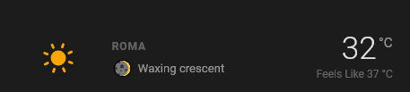
</p>

```yaml
type: custom:ha-card-weather-conditions
name: "Acquafredda"
language: it
weather:
  icons_model: pirateweather
  moonphase: sensor.moon_phase
  present:
    condition: sensor.home_condition
    temperature: sensor.home_temperature
    temperature_feelslike: sensor.home_apparent_temperature
```

### Present Layer

Detailed current conditions: temperature range, humidity, wind, precipitation, and more.

<p float="left">
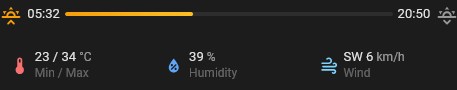
</p>

```yaml
type: custom:ha-card-weather-conditions
language: it
weather:
  icons_model: pirateweather
  sun: sun.sun
  sun_time_format: hh_mm
  present:
    temperature_min: sensor.home_temperature_min
    temperature_max: sensor.home_temperature_max
    humidity: sensor.home_relative_humidity
    pressure: sensor.home_pressure
    wind_bearing: sensor.home_wind_bearing
    wind_speed: sensor.home_wind_speed
    precipitation_intensity: sensor.home_precipitation
    precipitation_probability: sensor.home_precipitation_probability
    precipitation_accumulation: sensor.home_precipitation_accumulation
    lightning_azimuth: sensor.home_lightning_azimuth
    lightning_distance: sensor.home_lightning_distance
    lightning_strikes: sensor.home_lightning_strikes_last_30s
```

### Daily Forecast Layer

Multi-day overview with high/low temperatures, precipitation probability, and condition icons.

<p float="left">
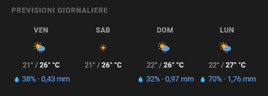
</p>

```yaml
type: custom:ha-card-weather-conditions
language: it
weather:
  icons_model: pirateweather
  daily_forecasts:
    condition:
      slot1: sensor.home_daily_forecast_condition_d1
      slot2: sensor.home_daily_forecast_condition_d2
      slot3: sensor.home_daily_forecast_condition_d3
      slot4: sensor.home_daily_forecast_condition_d4
    temperature_high:
      slot1: sensor.home_daily_forecast_temperature_max_d1
      slot2: sensor.home_daily_forecast_temperature_max_d2
      slot3: sensor.home_daily_forecast_temperature_max_d3
      slot4: sensor.home_daily_forecast_temperature_max_d4
    temperature_low:
      slot1: sensor.home_daily_forecast_temperature_min_d1
      slot2: sensor.home_daily_forecast_temperature_min_d2
      slot3: sensor.home_daily_forecast_temperature_min_d3
      slot4: sensor.home_daily_forecast_temperature_min_d4
    precipitation_probability:
      slot1: sensor.home_daily_forecast_precipitation_probability_d1
      slot2: sensor.home_daily_forecast_precipitation_probability_d2
      slot3: sensor.home_daily_forecast_precipitation_probability_d3
      slot4: sensor.home_daily_forecast_precipitation_probability_d4
    precipitation_intensity:
      slot1: sensor.home_daily_forecast_precipitation_d1
      slot2: sensor.home_daily_forecast_precipitation_d2
      slot3: sensor.home_daily_forecast_precipitation_d3
      slot4: sensor.home_daily_forecast_precipitation_d4
```

### Hourly Forecast Layer

Hour-by-hour detail: temperature, feels-like, precipitation, and wind.

<p float="left">
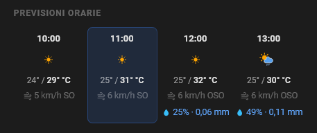
</p>

```yaml
type: custom:ha-card-weather-conditions
language: it
weather:
  icons_model: pirateweather
  hourly_forecasts:
    condition:
      slot1: sensor.home_hourly_forecast_condition_h1
      slot2: sensor.home_hourly_forecast_condition_h2
      slot3: sensor.home_hourly_forecast_condition_h3
      slot4: sensor.home_hourly_forecast_condition_h4
    temperature:
      slot1: sensor.home_hourly_forecast_temperature_h1
      slot2: sensor.home_hourly_forecast_temperature_h2
      slot3: sensor.home_hourly_forecast_temperature_h3
      slot4: sensor.home_hourly_forecast_temperature_h4
    temperature_feelslike:
      slot1: sensor.home_hourly_forecast_apparent_temperature_h1
      slot2: sensor.home_hourly_forecast_apparent_temperature_h2
      slot3: sensor.home_hourly_forecast_apparent_temperature_h3
      slot4: sensor.home_hourly_forecast_apparent_temperature_h4
    precipitation_intensity:
      slot1: sensor.home_hourly_forecast_precipitation_h1
      slot2: sensor.home_hourly_forecast_precipitation_h2
      slot3: sensor.home_hourly_forecast_precipitation_h3
      slot4: sensor.home_hourly_forecast_precipitation_h4
    precipitation_probability:
      slot1: sensor.home_hourly_forecast_precipitation_probability_h1
      slot2: sensor.home_hourly_forecast_precipitation_probability_h2
      slot3: sensor.home_hourly_forecast_precipitation_probability_h3
      slot4: sensor.home_hourly_forecast_precipitation_probability_h4
    wind_bearing:
      slot1: sensor.home_hourly_forecast_wind_bearing_h1
      slot2: sensor.home_hourly_forecast_wind_bearing_h2
      slot3: sensor.home_hourly_forecast_wind_bearing_h3
      slot4: sensor.home_hourly_forecast_wind_bearing_h4
    wind_speed:
      slot1: sensor.home_hourly_forecast_wind_speed_h1
      slot2: sensor.home_hourly_forecast_wind_speed_h2
      slot3: sensor.home_hourly_forecast_wind_speed_h3
      slot4: sensor.home_hourly_forecast_wind_speed_h4
```

### Marine Daily Forecast Layer

Daily marine conditions: wave height, dominant wave direction, swell and wind waves, and their periods.

<p float="left">
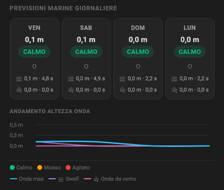
</p>

```yaml
type: custom:ha-card-weather-conditions
language: it
weather:
  icons_model: pirateweather
  marine_daily_forecasts:
    wave_height_max:
      slot1: sensor.marine_wave_height_max_day_0
      slot2: sensor.marine_wave_height_max_day_1
      slot3: sensor.marine_wave_height_max_day_2
      slot4: sensor.marine_wave_height_max_day_3
    wave_direction:
      slot1: sensor.marine_wave_direction_dominant_day_0
      slot2: sensor.marine_wave_direction_dominant_day_1
      slot3: sensor.marine_wave_direction_dominant_day_2
      slot4: sensor.marine_wave_direction_dominant_day_3
    swell_wave_height_max:
      slot1: sensor.marine_swell_wave_height_max_day_0
      slot2: sensor.marine_swell_wave_height_max_day_1
      slot3: sensor.marine_swell_wave_height_max_day_2
      slot4: sensor.marine_swell_wave_height_max_day_3
    wind_wave_height_max:
      slot1: sensor.marine_wind_wave_height_max_day_0
      slot2: sensor.marine_wind_wave_height_max_day_1
      slot3: sensor.marine_wind_wave_height_max_day_2
      slot4: sensor.marine_wind_wave_height_max_day_3
    swell_wave_period_max:
      slot1: sensor.marine_swell_wave_period_max_day_0
      slot2: sensor.marine_swell_wave_period_max_day_1
      slot3: sensor.marine_swell_wave_period_max_day_2
      slot4: sensor.marine_swell_wave_period_max_day_3
    wind_wave_period_max:
      slot1: sensor.marine_wind_wave_period_max_day_0
      slot2: sensor.marine_wind_wave_period_max_day_1
      slot3: sensor.marine_wind_wave_period_max_day_2
      slot4: sensor.marine_wind_wave_period_max_day_3
```

### Marine Hourly Forecast Layer

Hourly marine conditions: swell direction, height and period, wind speed and direction, air and water temperature.

```yaml
type: custom:ha-card-weather-conditions
language: it
weather:
  icons_model: pirateweather
  marine_hourly_forecasts:
    swell_direction:
      slot1: sensor.marine_swell_direction_h1
      slot2: sensor.marine_swell_direction_h2
      slot3: sensor.marine_swell_direction_h3
      slot4: sensor.marine_swell_direction_h4
    swell_height:
      slot1: sensor.marine_swell_height_h1
      slot2: sensor.marine_swell_height_h2
      slot3: sensor.marine_swell_height_h3
      slot4: sensor.marine_swell_height_h4
    swell_period:
      slot1: sensor.marine_swell_period_h1
      slot2: sensor.marine_swell_period_h2
      slot3: sensor.marine_swell_period_h3
      slot4: sensor.marine_swell_period_h4
    wind_direction:
      slot1: sensor.marine_wind_direction_h1
      slot2: sensor.marine_wind_direction_h2
      slot3: sensor.marine_wind_direction_h3
      slot4: sensor.marine_wind_direction_h4
    wind_speed:
      slot1: sensor.marine_wind_speed_h1
      slot2: sensor.marine_wind_speed_h2
      slot3: sensor.marine_wind_speed_h3
      slot4: sensor.marine_wind_speed_h4
    air_temperature:
      slot1: sensor.marine_air_temperature_h1
      slot2: sensor.marine_air_temperature_h2
      slot3: sensor.marine_air_temperature_h3
      slot4: sensor.marine_air_temperature_h4
    water_temperature:
      slot1: sensor.marine_water_temperature_h1
      slot2: sensor.marine_water_temperature_h2
      slot3: sensor.marine_water_temperature_h3
      slot4: sensor.marine_water_temperature_h4
```

### Alerts Layer

Weather alerts from MeteoAlarm and the Italian Civil Protection Department (DPC).

<p float="left">
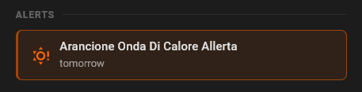
</p>

```yaml
type: custom:ha-card-weather-conditions
language: it
weather:
  icons_model: pirateweather
  meteoalarm: binary_sensor.italy_basilicata_meteo_alarm
  dpcalarm:
    thunderstorms: binary_sensor.dpc_basilicata_temporali_oggi
    hydraulic: binary_sensor.dpc_basilicata_idraulico_oggi
    hydrogeological: binary_sensor.dpc_basilicata_idrogeologico_oggi
```

### Ultraviolet Layer

UV index, ozone concentration, protection window, and skin-type-specific safe exposure times.

<p float="left">
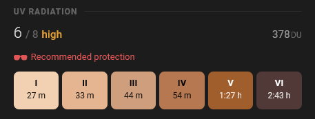
</p>

```yaml
type: custom:ha-card-weather-conditions
language: it
ultraviolet:
  protection_window: binary_sensor.openuv_protection_window
  ozone_level: sensor.openuv_current_ozone_level
  uv_index: sensor.openuv_current_uv_index
  uv_level: sensor.openuv_current_uv_level
  max_uv_index: sensor.openuv_max_uv_index
  set_skin_type_1: sensor.openuv_skin_type_1_safe_exposure_time
  set_skin_type_2: sensor.openuv_skin_type_2_safe_exposure_time
  set_skin_type_3: sensor.openuv_skin_type_3_safe_exposure_time
  set_skin_type_4: sensor.openuv_skin_type_4_safe_exposure_time
  set_skin_type_5: sensor.openuv_skin_type_5_safe_exposure_time
  set_skin_type_6: sensor.openuv_skin_type_6_safe_exposure_time
```

### Pollen Layer

Airborne pollen levels for tree, weed, and grass types.

<p float="left">
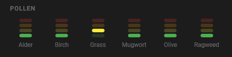
</p>

```yaml
type: custom:ha-card-weather-conditions
language: it
pollen:
  min: 1
  max: 4
  entities:
    - name: Alder
      entity: sensor.openmeteo_pollen_alder_level
    - name: Birch
      entity: sensor.openmeteo_pollen_birch_level
    - name: Grass
      entity: sensor.openmeteo_pollen_grass_level
    - name: Mugwort
      entity: sensor.openmeteo_pollen_mugwort_level
    - name: Olive
      entity: sensor.openmeteo_pollen_olive_level
    - name: Ragweed
      entity: sensor.openmeteo_pollen_ragweed_level
```

### Air Quality Layer

PM2.5, PM10, ozone, carbon monoxide, and EPA air quality index.

<p float="left">
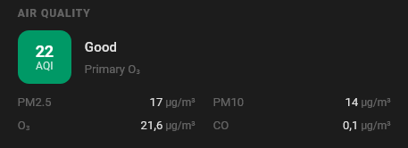
</p>

```yaml
type: custom:ha-card-weather-conditions
language: it
airquality:
  pm25: sensor.lazio_italy_pm2_5
  pm10: sensor.lazio_italy_pm10
  o3: sensor.roma_lazio_italy_ozone
  co: sensor.roma_lazio_italy_carbon_monoxide
  epa_aqi: sensor.lazio_italy_air_quality_index
  epa_primary_pollutant: sensor.lazio_italy_dominant_pollutant
```

### Wind Map Layer

Small map centered on the configured (or Home Assistant home) coordinates, showing the current wind direction and speed.

<p float="left">
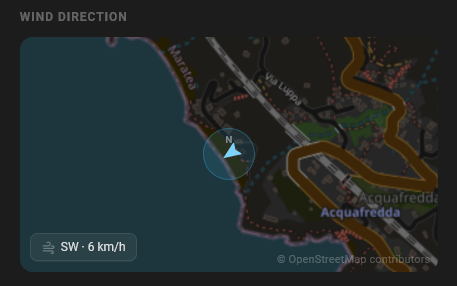
</p>

```yaml
type: custom:ha-card-weather-conditions
language: it
weather:
  icons_model: pirateweather
  present:
    wind_bearing: sensor.home_wind_bearing
    wind_speed: sensor.home_wind_speed
wind_map:
  enabled: true
  zoom: 13
  tile_style: standard
  tile_dark: true
```

---

## Full Example (Rome)

A complete configuration combining all supported layers.

```yaml
type: custom:ha-card-weather-conditions
name: "Roma"
language: it
number_format: comma_decimal
module_order:
  - summary
  - present
  - daily_forecasts
  - hourly_forecasts
  - marine_daily
  - marine_hourly
  - meteoalarm
  - pollen
  - ultraviolet
  - airquality
  - camera
  - wind_map
weather:
  icons_model: pirateweather
  animation: true
  sun: sun.sun
  sun_time_format: hh_mm
  moonphase: sensor.moon_phase
  present:
    condition: sensor.home_rome_hourly_forecast_condition_h1
    temperature: sensor.home_rome_hourly_forecast_temperature_h1
    temperature_feelslike: sensor.home_rome_hourly_forecast_apparent_temperature_h1
    temperature_min: sensor.home_rome_daily_forecast_temperature_min_d0
    temperature_max: sensor.home_rome_daily_forecast_temperature_max_d0
    humidity: sensor.home_rome_hourly_forecast_humidity_h1
    pressure: sensor.home_rome_hourly_forecast_pressure_h1
    wind_bearing: sensor.home_rome_hourly_forecast_wind_bearing_h1
    wind_speed: sensor.home_rome_hourly_forecast_wind_speed_h1
    precipitation_intensity: sensor.home_rome_hourly_forecast_precipitation_h1
    precipitation_probability: sensor.home_rome_hourly_forecast_precipitation_probability_h1
    lightning_azimuth: sensor.rome_lightning_lightning_azimuth
    lightning_distance: sensor.rome_lightning_lightning_distance
    lightning_strikes: sensor.rome_lightning_strikes_last_30s
  meteoalarm: binary_sensor.italy_lazio_meteo_alarm
  dpcalarm:
    thunderstorms: binary_sensor.dpc_rome_lazio_temporali_oggi
    hydraulic: binary_sensor.dpc_rome_lazio_idraulico_oggi
    hydrogeological: binary_sensor.dpc_rome_lazio_idrogeologico_oggi

ultraviolet:
  protection_window: binary_sensor.openuv_rome_protection_window
  ozone_level: sensor.openuv_rome_current_ozone_level
  uv_index: sensor.openuv_rome_current_uv_index
  uv_level: sensor.openuv_rome_current_uv_level
  max_uv_index: sensor.openuv_rome_max_uv_index
  set_skin_type_1: sensor.openuv_rome_skin_type_1_safe_exposure_time
  set_skin_type_2: sensor.openuv_rome_skin_type_2_safe_exposure_time
  set_skin_type_3: sensor.openuv_rome_skin_type_3_safe_exposure_time
  set_skin_type_4: sensor.openuv_rome_skin_type_4_safe_exposure_time
  set_skin_type_5: sensor.openuv_rome_skin_type_5_safe_exposure_time
  set_skin_type_6: sensor.openuv_rome_skin_type_6_safe_exposure_time

pollen:
  min: 1
  max: 4
  entities:
    - name: Alder
      entity: sensor.openmeteo_roma_pollen_alder_level
    - name: Birch
      entity: sensor.openmeteo_roma_pollen_birch_level
    - name: Grass
      entity: sensor.openmeteo_roma_pollen_grass_level
    - name: Mugwort
      entity: sensor.openmeteo_roma_pollen_mugwort_level
    - name: Olive
      entity: sensor.openmeteo_roma_pollen_olive_level
    - name: Ragweed
      entity: sensor.openmeteo_roma_pollen_ragweed_level

airquality:
  pm25: sensor.cipro_roma_lazio_italy_pm2_5
  pm10: sensor.cipro_roma_lazio_italy_pm10
  o3: sensor.cipro_roma_lazio_italy_ozone
  co: sensor.cipro_roma_lazio_italy_carbon_monoxide
  epa_aqi: sensor.cipro_roma_lazio_italy_air_quality_index
  epa_primary_pollutant: sensor.cipro_roma_lazio_italy_dominant_pollutant

camera: camera.5e0add8153fcd_streamlock_net

wind_map:
  enabled: true
  zoom: 12
  tile_style: standard
  tile_dark: true
  wind_bearing: sensor.home_rome_hourly_forecast_wind_bearing_h1
  wind_speed: sensor.home_rome_hourly_forecast_wind_speed_h1
```

---

[license-shield]: https://img.shields.io/github/license/r-renato/ha-card-weather-conditions
[buymecoffee]: https://www.buymeacoffee.com/0D3WbkKrn
[buymecoffeebadge]: https://img.shields.io/badge/buy%20me%20a%20coffee-donate-yellow?style=for-the-badge
